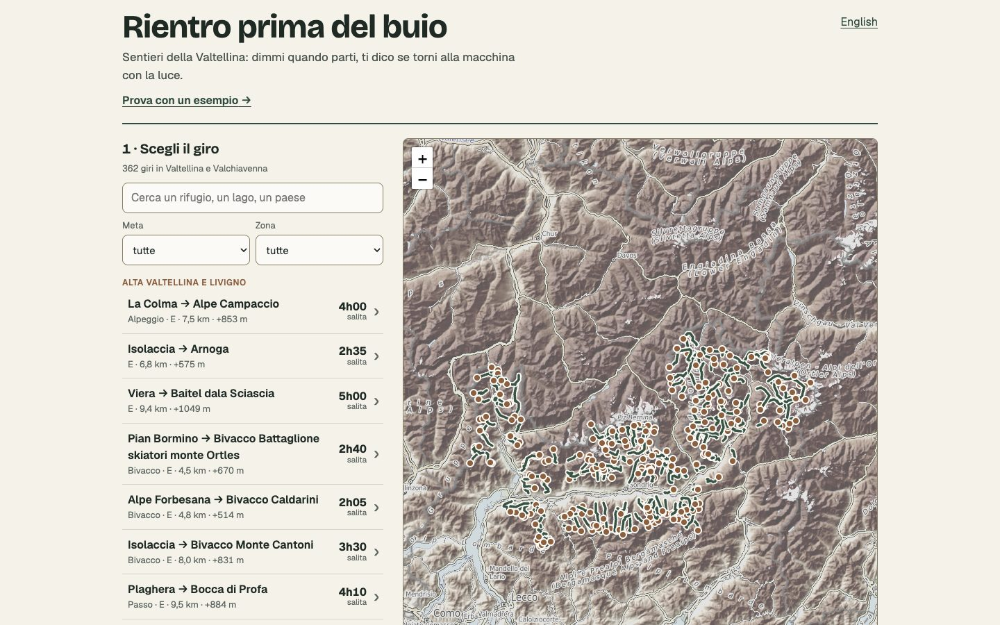
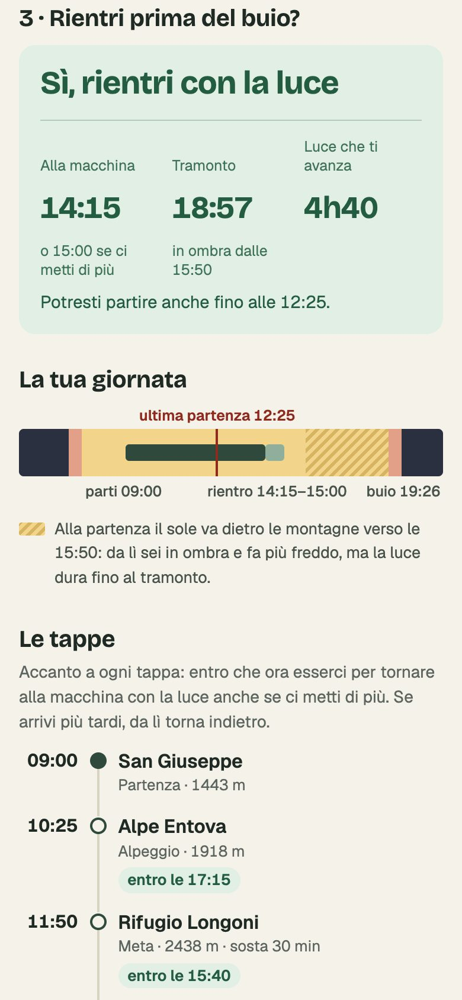

# Rientro prima del buio

Scegli un giro in Valtellina, il giorno e l'ora in cui parti: l'app ti dice se torni alla macchina con la luce (o, se dormi al rifugio, se ci arrivi con la luce), a che ora passi dalle tappe lungo il sentiero, quando tramonta il sole e che tempo fa alle quote in cui sarai.

**Provala: [vikybassi.github.io/rientro-prima-del-buio](https://vikybassi.github.io/rientro-prima-del-buio/)**

> **In English** — *Back before dark* is a web app for day hikes in Valtellina (Italian Alps). Pick one of 362 hikes, a date and a start time: it tells you whether you'll be back at the car before dark (or, if you sleep at the hut, whether you get there in daylight), when you'll pass each stop along the way and the latest time to turn back from it, sunset and the hourly forecast at the altitudes you'll be walking. Hikes are built from OpenStreetMap trail data and a 30 m terrain model; walking times start from the official CAI signpost times where they exist, otherwise from the DIN 33466 formula calibrated on those signposts. React + TypeScript, no backend, installable and usable offline. The interface is in Italian and English.





## Cosa fa

- **362 giri** in Valtellina e Valchiavenna, verso rifugi, bivacchi, laghi, passi e alpeggi, ognuno con partenza da un posto dove si arriva in macchina.
- **La risposta in una frase**: sì, rientri con la luce; al limite; no, rientri col buio. Sotto, i tre numeri che contano (alla macchina, tramonto, luce che avanza o manca) e l'ultima ora a cui puoi ancora partire con margine.
- **Dormo al rifugio o al bivacco**: se la meta è un rifugio o un bivacco puoi scegliere di dormire lì. Allora conta l'arrivo, non il rientro: la risposta dice se arrivi con la luce, e a che ora fa giorno l'indomani per scendere.
- **Le tappe lungo il percorso**: rifugi, bivacchi, alpeggi, laghi, passi, cime, fontane e punti panoramici che il sentiero tocca, con l'ora a cui ci passi e **entro che ora esserci** per tornare con la luce: se arrivi più tardi, da lì torni indietro. Quando il giro intero non ci sta, l'app propone la tappa più lontana raggiungibile con margine.
- **La giornata su una barra**: partenza, rientro (o arrivo), tramonto, fine del crepuscolo, e (tratteggiata) l'ora in cui il sole va dietro le montagne.
- **Il meteo nelle ore del giro**, alla quota della partenza e a quella della meta: temporali, pioggia, raffiche di vento, zero termico sotto la quota.
- **Il profilo del percorso** con l'ora a cui passi, e la mappa del tracciato.
- **Il tuo passo** (più piano, come o più veloce dei cartelli) e la sosta alla meta.
- **Link condivisibile**: giro, giorno, ora e passo stanno nell'indirizzo.
- **Funziona senza campo**: si installa sul telefono; i giri aperti a casa restano disponibili in montagna, con l'ultima previsione salvata.

<br clear="right">

## Come ragiona

**I giri.** Su OpenStreetMap la rete dei sentieri CAI della provincia di Sondrio è salvata a tratti, da un incrocio all'altro: dei 727 sentieri con nome, 561 iniziano o finiscono a un innesto. Per questo i giri nascono in due modi:

1. i **sentieri CAI interi** che da soli fanno una gita di giornata (42), con il tempo del cartello quando c'è;
2. gli **itinerari verso le mete** (320): tutta la rete diventa un grafo e per ogni meta si cerca il percorso più breve da un punto di partenza raggiungibile in macchina. I sentieri non numerati entrano solo dove la rete ha dei buchi e "costano" di più, così l'itinerario usa i sentieri segnati quando ci sono.

Una partenza vale solo se a pochi passi c'è una strada aperta al traffico: niente piste forestali chiuse o strade su permesso. Le strade a pedaggio e quelle da verificare sono segnalate.

**Le quote** vengono dal modello del terreno Copernicus GLO-30 (un punto ogni 30 m). Il dislivello si calcola ignorando le oscillazioni sotto i 5 m, una soglia tarata sui dislivelli ufficiali CAI: l'errore mediano è del 3%.

**I tempi.** Dove il sentiero ha il tempo del cartello CAI, si parte da quello. Altrimenti si usa la formula DIN 33466, corretta confrontandola con i tempi CAI di tutta la provincia: in mediana i cartelli sono il 10% più veloci della formula. Poi si applica il tuo passo. Ogni tempo ha anche una versione per "se ci metti di più" (stanchezza, imprevisti): il 15% in più, al massimo un'ora sull'intero giro.

**La luce.** Tramonto e fine del crepuscolo si calcolano per il punto di partenza e il giorno scelto, nel fuso di Roma. La risposta è sì se sei alla macchina almeno 30 minuti prima del tramonto anche mettendoci di più; al limite se col tuo passo rientri con la luce ma senza margine; no se già col tuo passo rientri col buio. Se per avere margine dovresti partire prima che faccia giorno, l'app lo dice.

**Il sole dietro le montagne.** Il tramonto astronomico suppone un orizzonte piatto; in valle il sole sparisce prima dietro le creste. Per la partenza e la meta di ogni giro uno script calcola l'orizzonte verso ovest dal modello del terreno: direzione per direzione, da sud a nord-ovest, l'altezza delle montagne fino a 40 km, con curvatura terrestre e rifrazione (e ignorando i primi 300 m, dove il modello vede la cima degli alberi). L'app confronta l'orizzonte con la posizione del sole e dice da che ora si è in ombra: a San Giuseppe (Valmalenco) a inizio ottobre il sole va dietro la cresta verso le 15:50, tre ore prima del tramonto. È un'informazione in più (in ombra fa più freddo), non cambia la risposta: la luce per camminare dura fino al tramonto e oltre.

**Le tappe** sono i punti di OpenStreetMap a meno di 60–150 m dalla traccia (a seconda del tipo: una fontana deve essere proprio sul sentiero, un rifugio può stare poco discosto), esclusi i primi e gli ultimi 250 m; due punti a meno di 300 m l'uno dall'altro contano come uno, e vince il più utile (un rifugio batte una fontana). Al massimo 8 per giro. L'ora "entro le" di una tappa è l'ultima a cui puoi esserci e tornare alla macchina 30 minuti prima del tramonto anche mettendoci di più: in alpinismo si chiama punto di non ritorno.

**Il meteo** arriva da Open-Meteo, ora per ora, per la partenza e per la meta alla loro quota. Un temporale previsto o raffiche oltre gli 80 km/h nelle ore del giro cambiano la risposta in "meglio di no", anche con tutta la luce del mondo; pioggia probabile, vento forte e zero termico basso sono avvisi. Le previsioni coprono i prossimi 16 giorni; per le date più lontane l'app lo dice.

## Com'è fatta

- **App**: React 19, TypeScript, Vite. Nessun server: i dati dei giri sono file statici, il meteo arriva direttamente dal browser.
- **Mappe**: Leaflet con le carte di OpenTopoMap, caricate solo quando servono.
- **Sole**: [suncalc](https://github.com/mourner/suncalc).
- **Offline**: service worker generato da Workbox (vite-plugin-pwa). L'app e la mappa d'insieme si salvano alla prima visita, le tracce quando si aprono, e della mappa solo i riquadri già visti: le regole d'uso di OpenTopoMap vietano di scaricarli in blocco.
- **Test**: 110 test (Vitest) sul motore dei tempi, della luce, dell'ombra delle montagne, delle tappe e del meteo, sui filtri, sui formati, sulle etichette della barra e sul link condivisibile.
- **Caratteri**: Bricolage Grotesque per titoli e numeri, Geist per il testo (Fontsource, nessuna richiesta a servizi esterni; salvati anche per l'uso offline).
- **Pubblicazione**: a ogni push su `main` GitHub Actions esegue lint e test, costruisce l'app e la pubblica su GitHub Pages.

```
src/engine/      tempi, sole, meteo e risposta (logica pura, testata)
src/components/  interfaccia
scripts/         costruzione dei giri da OpenStreetMap e dal modello del terreno
research/        appunti e verifiche fatte durante lo sviluppo
```

### Avviarla

```bash
npm install
npm run dev
```

L'app si apre su `http://localhost:5173/rientro-prima-del-buio/`, lo stesso percorso che ha su GitHub Pages. Altri comandi: `npm test`, `npm run lint`, `npm run build`.

### Rigenerare i giri

I dati pronti sono già nel repository (`src/data/trails.json`, `public/trails/`). Per ricostruirli da zero servono circa 250 MB di modello del terreno e qualche minuto di richieste a Overpass:

```bash
sh scripts/download-dem.sh
node scripts/prefetch-overpass.ts
node scripts/prefetch-places.ts
node scripts/prefetch-roads.ts
node scripts/prefetch-paths.ts
node scripts/prefetch-zones.ts
node scripts/screen-candidates.ts
node scripts/build-itineraries.ts
npm run build:trails
node scripts/prefetch-stops.ts
node scripts/add-stops.ts
node scripts/add-horizon.ts
```

Gli script girano con Node 22 o successivo. I download finiscono in `data-cache/`, esclusa da git.

## Limiti

È uno strumento per organizzare la gita, non per decidere in montagna. I tempi sono stime; i dati di OpenStreetMap possono essere incompleti o non aggiornati (manca per esempio il sentiero per il Rifugio Allievi); il meteo in quota cambia in fretta. La difficoltà indicata è quella dichiarata su OpenStreetMap. Prima di partire controlla il bollettino, lo stato di sentieri e strade, e tieniti un margine.

## Crediti e licenze

- Sentieri, luoghi e strade: © [OpenStreetMap](https://www.openstreetmap.org/copyright) contributors, licenza [ODbL](https://opendatacommons.org/licenses/odbl/). I dati dei giri in `src/data/` e `public/` ne derivano e restano sotto ODbL.
- Carte: © [OpenTopoMap](https://opentopomap.org) (CC-BY-SA).
- Quote: Copernicus GLO-30 Digital Elevation Model, © DLR e Airbus, fornito nell'ambito del programma Copernicus.
- Meteo: [Open-Meteo](https://open-meteo.com) (CC BY 4.0).

Il codice è sotto licenza [MIT](LICENSE).
